# agentic-devops

## Overview

This is a **intentionally broken demonstration application** designed to showcase the autonomous DevOps loop powered by AI agents. The application demonstrates how an SRE (Site Reliability Engineer) agent can identify issues in Azure, and a coding agent can automatically push fixes to resolve them.

## Application Purpose

The application features:
- **Landing Page**: Entry point with two interactive links
- **Working Link**: `/todos` - Displays a list of in-memory todo items (functional)
- **Broken Link**: `/todos/create` - Attempts to show a todo creation page but throws an `UnsupportedOperationException` (intentionally broken)

The broken endpoint is designed to fail, allowing the agentic system to detect the issue, diagnose it, and automatically implement a fix.

## The Agentic DevOps Loop

This application demonstrates the autonomous DevOps workflow where agents work together to maintain system reliability:

```mermaid
graph TD
    A["🌍 Application Running in Azure"] -->|"Monitoring & Health Checks"| B["📊 SRE Agent Detects Issue"]
    B -->|"Issue Found: 500 Error on /todos/create"| C["🔍 SRE Agent Analyzes Problem"]
    C -->|"Error Details & Stack Trace"| D["🤖 Coding Agent Receives Report"]
    D -->|"Examines Codebase"| E["📝 Identifies Root Cause"]
    E -->|"Generates Fix"| F["💾 Coding Agent Implements Solution"]
    F -->|"Pushes Code to Repository"| G["📦 Code Commit & Push"]
    G -->|"Triggers CI/CD Pipeline"| H["🚀 Automated Deployment"]
    H -->|"Deploys Fixed Version"| I["✅ Fixed Application Running"]
    I -->|"Health Check Passes"| J["🎉 System Resolved"]
    J -->|"Continuous Monitoring"| B
    
    style A fill:#e1f5ff
    style B fill:#fff3e0
    style C fill:#fff3e0
    style D fill:#f3e5f5
    style E fill:#f3e5f5
    style F fill:#f3e5f5
    style G fill:#e8f5e9
    style H fill:#e8f5e9
    style I fill:#e1f5ff
    style J fill:#c8e6c9
```



## Architecture

### Project Structure

```
src/main/java/com/joranbergfeld/agentic_devops_demo/
├── controller/
│   ├── HomeController.java      # Serves the landing page
│   ├── TodoController.java      # Lists todos (working endpoint)
│   └── CreateTodoController.java # Creates todos (intentionally broken)
├── service/
│   └── TodoService.java         # In-memory todo list management
└── AgenticDevopsDemoApplication.java

src/main/resources/
├── templates/
│   ├── index.html              # Landing page with links
│   ├── todos.html              # Todo list view
│   └── create-todo.html        # Todo creation form
└── application.yml             # Configuration
```

### Key Components

- **HomeController**: Entry point serving the landing page
- **TodoController**: Successfully retrieves and displays todos from the service
- **CreateTodoController**: Intentionally throws `UnsupportedOperationException` to simulate a production issue
- **TodoService**: Manages an in-memory list of todo items
- **Thymeleaf Templates**: Server-side templating for rendering views

## How It Works

### The Flow:

1. **Issue Creation**: A user attempts to access `/todos/create` which throws an unhandled exception
2. **Detection**: The SRE agent (monitoring system in Azure) detects the HTTP 500 error
3. **Analysis**: The SRE agent collects error logs, stack traces, and contextual information
4. **Handoff**: The coding agent receives the incident report and begins analysis
5. **Fix**: The coding agent examines the codebase, identifies the issue, and implements a fix
6. **Deployment**: The fix is committed, pushed, and automatically deployed via CI/CD
7. **Resolution**: The application now functions correctly
8. **Verification**: Health checks confirm the issue is resolved

## Getting Started

### Prerequisites
- Java 17+
- Maven 3.6+
- Spring Boot 3.5.6

### Running the Application

```bash
mvn spring-boot:run
```

The application will start on `http://localhost:8080`

### Testing the Flow

1. Visit `http://localhost:8080/` - See the landing page
2. Click **"View Todos (Working)"** - See the list of todos (works correctly)
3. Click **"Create Todo (Broken)"** - Observe the error (intentionally broken)

This broken endpoint is where the agentic loop begins!

## Technologies Used

- **Spring Boot 3.5.6**: Framework for building the web application
- **Thymeleaf**: Server-side templating engine
- **Java 17**: Programming language
- **Maven**: Build and dependency management

## Demonstration Scenario

This application is specifically designed to demonstrate:

✅ **Problem Detection**: SRE agents identifying issues in production  
✅ **Root Cause Analysis**: Coding agents analyzing error patterns  
✅ **Autonomous Fix Generation**: Agents implementing solutions without human intervention  
✅ **Automated Deployment**: CI/CD integration for seamless updates  
✅ **Continuous Improvement**: The loop repeats for ongoing reliability  

## Future Enhancements

- Add more deliberately broken endpoints to demonstrate different failure scenarios
- Implement actual todo persistence (database)
- Add authentication and authorization
- Integrate with Azure Monitor for real SRE integration
- Add metrics and observability

---

**Note**: This application is intentionally designed with bugs to demonstrate agentic AI capabilities in DevOps scenarios. In production, you would want a fully functional application!